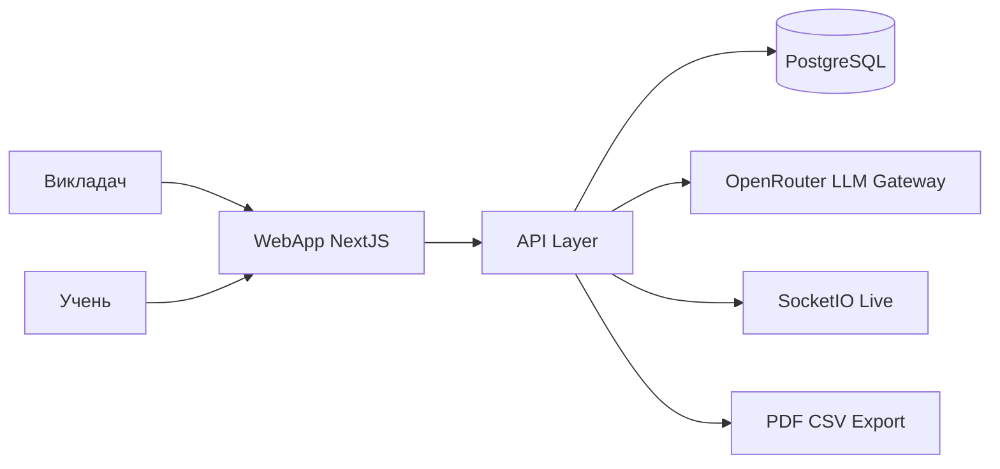

# SmartTest AI — повний опис проєкту

## Що таке SmartTest AI

**SmartTest AI** — це завершена веб-платформа для освітнього тестування, яка об’єднує створення тестів, проведення перевірок знань, живий моніторинг і аналітику в одному продукті.

Головна ідея сервісу: автоматизувати найскладніший і найдовший етап для викладача — підготовку якісного тесту. Система приймає навчальний матеріал (PDF, DOCX або текст), за допомогою AI формує чернетку питань, а викладач швидко доводить результат до методично правильного вигляду й запускає тест для групи.

---

## Навіщо створено цей проєкт

Ринок давно має сервіси для онлайн-проходження тестів, але в реальному навчальному процесі вузьким місцем є не форма проходження, а підготовка змісту. Викладачі витрачають багато часу на:

- ручне створення питань;
- підбір дистракторів;
- перевірку якості формулювань;
- адаптацію складності під конкретну аудиторію.

SmartTest AI вирішує саме цю проблему. Його ключова цінність — зв’язка **«матеріал курсу → готовий тест за хвилини»**, а не просто ще один інтерфейс з варіантами відповіді.

---

## Для кого платформа

### Викладачі та методисти

Школи, коледжі, університети, репетитори, тренери навчальних програм — усі, кому потрібно швидко й системно готувати перевірочні роботи.

### Учні та студенти

Користувачі, які проходять тест без складної реєстрації: достатньо PIN-коду або посилання від викладача.

### Заклади освіти

Організації, яким потрібен централізований контроль знань, аналітика по групах і викладачах, а також можливість розгортання в власній інфраструктурі.

---

## Як виглядає робота в системі

1. Викладач завантажує лекцію або методичний матеріал.
2. AI генерує чернетку тесту з питаннями та дистракторами.
3. Викладач редагує контент, задає правила тестування.
4. Система публікує доступ через PIN, QR або пряме посилання.
5. Учні проходять тест у адаптивному інтерфейсі.
6. Викладач бачить live-статус і підсумкову аналітику.
7. Результати експортуються в табличний формат, за потреби генерується PDF.

---

## Реалізований функціонал

## Функції викладача

- імпорт контенту з PDF, DOCX, TXT;
- AI-генерація питань за темою, кількістю й рівнем складності;
- ручний редактор тесту;
- підтримка типів питань: одна відповідь, декілька відповідей, правда/хиба, відкрита відповідь;
- додавання ілюстрацій до питань;
- банк питань для повторного використання;
- налаштування правил проходження (час, доступність, порядок, показ помилок);
- запуск тесту за PIN / QR / посиланням;
- live-моніторинг проходження;
- аналітика по групі та окремих учасниках;
- експорт CSV/Excel;
- генерація PDF (бланки + ключ).

## Функції учня

- швидкий вхід за PIN без обов’язкового акаунта;
- адаптивний плеєр тесту;
- прогрес-індикатор і таймер;
- підтримка навігації та повернення до питання (за політикою тесту);
- миттєвий підрахунок результату після завершення.

## Додаткові режими

- режим змагання для групових сесій;
- інституційний рівень статистики;
- AI-аналіз відкритих відповідей за заданими критеріями.

---

## Архітектура рішення

### Логічна модель

Платформа реалізована як fullstack-вебзастосунок: фронтенд і серверна логіка працюють узгоджено в одному контурі, але з чітким розділенням відповідальностей між UI, API, даними, AI-модулем і модулем реального часу.

---

## Технологічний стек

| Рівень | Технології |
|-------|------------|
| Frontend | Next.js, React, TypeScript, Redux Toolkit, Tailwind CSS, shadcn/Radix |
| Backend | Next.js server layer, Auth.js, Zod |
| Дані | PostgreSQL, Prisma ORM |
| Real-time | Socket.IO |
| AI | OpenRouter як шлюз до LLM |
| Документи | Обробка PDF/DOCX, генерація PDF |
| Інфраструктура | Docker, Docker Compose, VPS Ubuntu, Nginx, HTTPS |

---

## Апаратна та інфраструктурна частина

Система розрахована на типовий серверний контур навчального закладу або хмарний VPS:

- сервер Linux (Ubuntu);
- контейнерний запуск через Docker Compose;
- окремі сервіси застосунку та бази даних;
- Nginx як reverse proxy;
- TLS/HTTPS для публічного доступу;
- можливість масштабування при зростанні кількості одночасних тестувань або AI-викликів.

Такий підхід спрощує супровід, оновлення та перенесення системи між середовищами.

---

## Безпека та обробка даних

У SmartTest AI реалізовано багаторівневий безпековий підхід:

- шифрування трафіку (HTTPS);
- зберігання ключів і секретів лише у змінних середовища;
- рольове розмежування доступу між викладачем та учнем;
- валідація вхідних даних на API-рівні;
- контроль розміру та типу завантажень;
- обмеження частоти чутливих запитів;
- централізована обробка помилок без витоку внутрішніх деталей;
- мінімізація персональних даних і налаштовувані політики зберігання.

Внутрішні промпти, конкретні параметри моделей і технічні оптимізації AI-контру не розкриваються в публічному описі.

---

## Практичний ефект впровадження

Використання SmartTest AI дає вимірюваний результат у щоденній роботі:

- викладачі витрачають менше часу на створення тестів;
- якість питань і варіантів відповіді стає стабільнішою;
- запуск тестування в групі проходить швидше;
- учні отримують прозорий і зрозумілий процес перевірки;
- адміністрація закладу отримує дані для аналізу якості навчання;
- змішаний і дистанційний формати підтримуються в єдиному інструменті.

---

## Підсумок

**SmartTest AI** — це завершений практичний продукт для цифрового освітнього оцінювання, у якому головна інновація полягає в AI-автоматизації підготовки тестового контенту. Платформа поєднує швидкість створення, контроль проведення, аналітику результатів і безпечну інфраструктурну модель, що робить її придатною до стабільної експлуатації в реальних умовах навчальних закладів.
